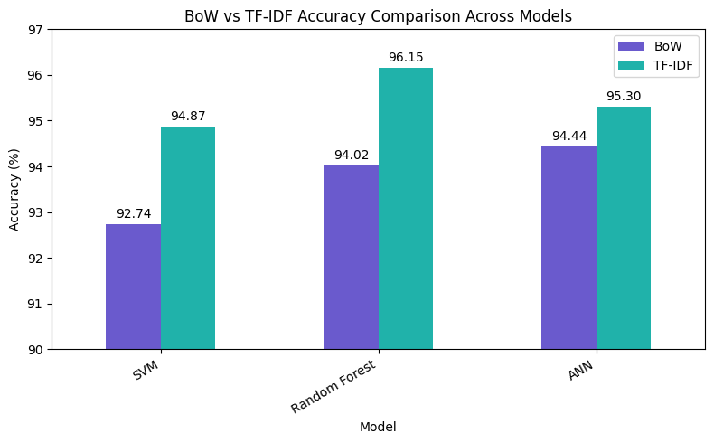

# Sports or Politics Classifier
## CSL7640 : Natural Language Understanding
## Assignment 1 Problem-4

This project implements a binary text classification system that categorizes news articles as **Sports** or **Politics** using classical Natural Language Understanding techniques.

A key objective of this work is a **implementation of feature representations** and **machine learning models**, with all feature extraction implemented from scratch.

---

## Problem Statement

Design a classifier that reads a text document and classifies it as **Sports** or **Politics**.  
The system must:
- implement feature representations: n-grams, Bag of Words(BoW), TF-IDF from scratch
- compare at least three machine learning techniques
- analyze the effect of different feature representations

---

## Dataset

The dataset is constructed by combining:
- [**BBC News Articles Dataset**](https://github.com/mdsohaib/BBC-News-Classification/blob/master/bbc-text.csv)
- [**Indian News Articles Dataset**](https://www.kaggle.com/datasets/jatinkalra17/indian-news-articles-dataset?resource=download)

Each article is labeled as one of the following:
- `Sports`
- `Politics`

Final dataset used for experiments:
```
sports_politics_dataset.csv
```

---

## Text Preprocessing

The following preprocessing steps were applied to all documents:

- Lowercasing
- Removal of URLs and special characters
- Stopword removal
- Digit normalization
- Whitespace-based tokenization

These steps reduce noise while preserving domain-specific signals, especially because numerical references common and important in sports articles.

---

## Feature Representation (From Scratch)

All feature representations were implemented **from scratch**, without using NLP libraries such as `scikit-learn`, `nltk`, or `spaCy`.

The following representations were explicitly implemented and evaluated:

- **Bag of Words (BoW)** – raw term frequency counts
- **TF-IDF** – term frequency weighted by inverse document frequency
- **n-grams** – unigrams and bigrams

Both BoW and TF-IDF were evaluated using the **same vocabulary**, train-test split, and model configurations to ensure fair comparison.

---

## Machine Learning Models

The following machine learning models were trained and evaluated:

1. **Support Vector Machine (Linear SVM)**
2. **Random Forest Classifier**
3. **Artificial Neural Network (ANN / MLP)**
   - Two hidden layers
   - ReLU activation in the first hidden layer
   - Tanh activation in the second hidden layer
   - Sigmoid activation at the output layer

---

## Experimental Results

### Overall Accuracy Comparison

| Model | BoW Accuracy | TF-IDF Accuracy |
|------|-------------|----------------|
| SVM | 92.74% | **94.87%** |
| Random Forest | 94.02% | **96.15%** |
| ANN | 94.44% | **95.30%** |


The following figure compares the performance of **Bag of Words (BoW)** and **TF-IDF** feature representations across different machine learning models.




### Observations

- TF-IDF consistently outperformed Bag of Words across all models.
- Random Forest with TF-IDF achieved the highest accuracy overall.
- ANN performance was competitive after hyperparameter tuning.
- BoW performed reasonably well but suffered from over-emphasis on frequent terms.

---

## Inference and Demo

A prediction script is provided to classify unseen news articles using **all six combinations**:

- SVM + BoW
- SVM + TF-IDF
- Random Forest + BoW
- Random Forest + TF-IDF
- ANN + BoW
- ANN + TF-IDF

### How to Run
```bash
python -m inference.predict
```

### Input
- A `.txt` file containing a news article

### Output
Predictions from all six model-feature combinations.

---

## Analysis of Mixed-Domain Articles

The system was tested on articles that span both sports and political contexts (e.g., sportspersons who later entered politics like Mr. Navjot Singh Sidhu).  
The classifier consistently identified the topic which was dominant rather than relying on isolated keywords, demonstrating robustness in realistic scenarios.

---

## Limitations and Future Work

- The system performs **single-label classification**, which may not fully capture articles spanning multiple domains.
- Performance could improve with larger datasets or contextual embeddings.
- Future work could explore **multi-label classification** and transformer-based language models.

---

## Reproducibility

To reproduce the results:

1. Run preprocessing scripts to construct the dataset
2. Train models using:
```bash
python -m models.train_svm
python -m models.train_random_forest
python -m models.train_ann
```

3. Perform inference using `predict.py`

---

## Author

Shashank Parchure

B23CM1059

